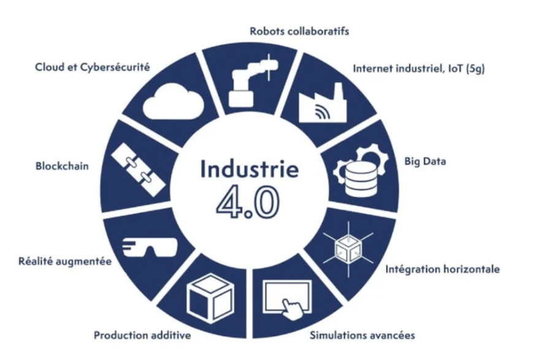
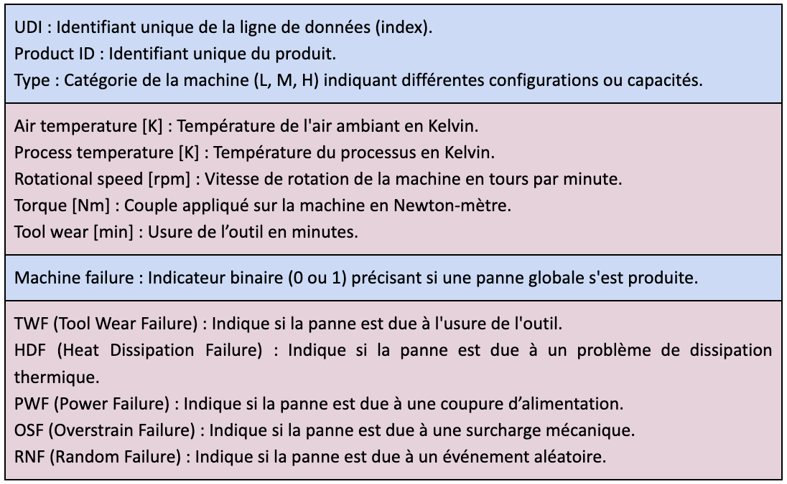
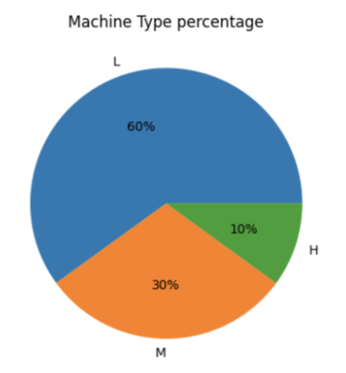
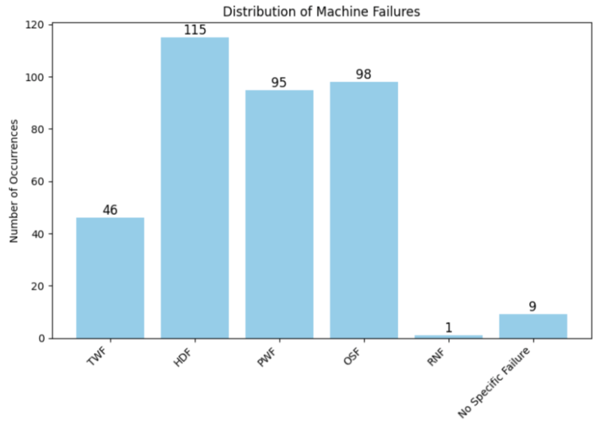
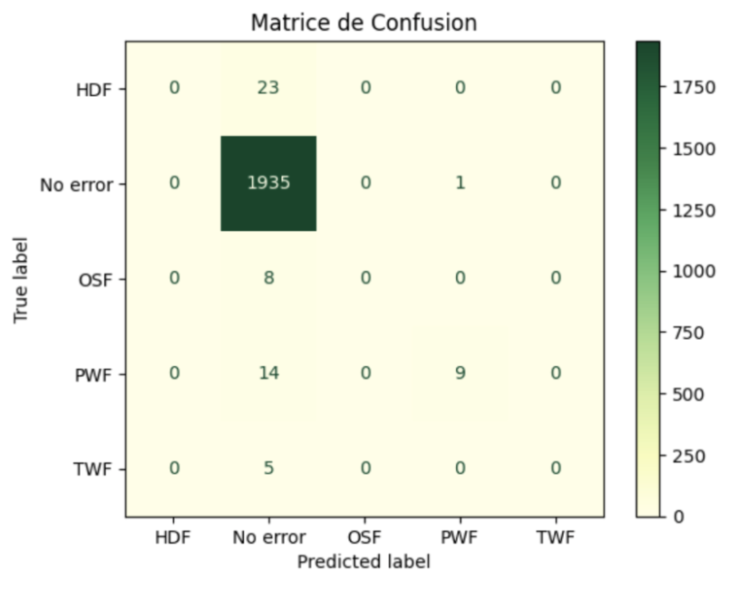
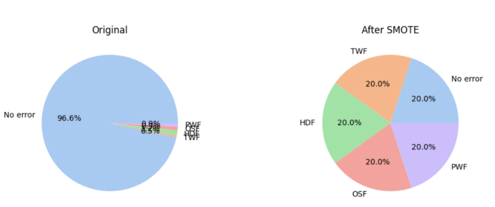
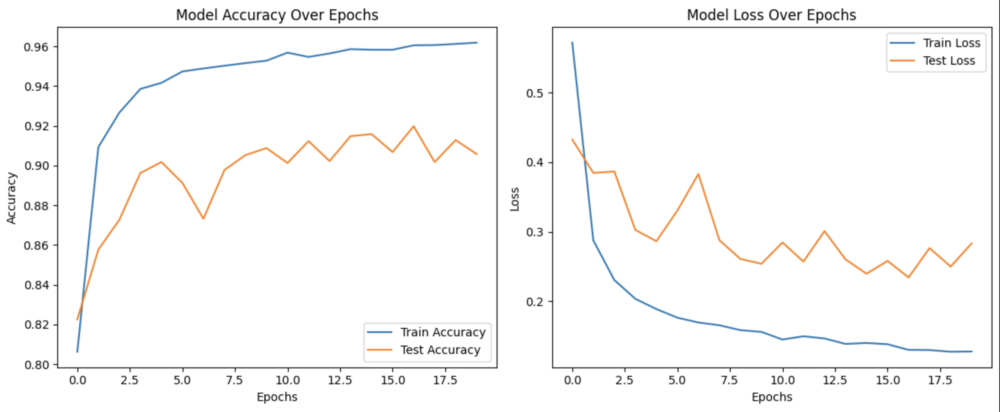

## Compte rendu de projet - IA embarqué

Ce projet consiste à concevoir, entraîner et déployer un réseau de neurones (DNN) pour la maintenance prédictive, en utilisant le jeu de données AI4I 2020 Predictive Maintenance Dataset. L'objectif final est de déployer le modèle sur un microcontrôleur STM32L4R9 à l'aide de STM32Cube.AI.

Le projet couvrira les étapes suivantes :
- Prétraitement des données
- Conception et entraînement du modèle
- Évaluation des performances
- Conversion du modèle pour de l’embarqué
- Intégration pour exécution sur STM32L4R9

## Introduction

De nos jours, avec l'émergence de l'industrie 4.0, le secteur manufacturier connaît une transformation sans précédent grâce aux nouvelles technologies comme l'IoT, l'intelligence artificielle et l'analyse des données.

<div align="center">
    
    <p><em>Figure 1 : Les neuf piliers de l’industrie 4.0</em></p>
</div>

Remplacer une machine entière coûte bien plus cher que de changer un simple composant, d'où l'intérêt d'installer des capteurs pour surveiller leur état en temps réel. En collectant et analysant ces données, les entreprises peuvent optimiser la maintenance, réduire les coûts et éviter les arrêts imprévus. À cet effet, nous nous demanderons 
> Comment concevoir et déployer un modèle de maintenance prédictive efficace sur un microcontrôleur à ressources limitées, tout en garantissant des performances optimales pour la détection des pannes ?

Pour répondre à cette attente, il faudra concevoir un modèle de maintenance prédictive capable d’analyser les données tout en étant optimisé pour une exécution sur un microcontrôleur à ressources limitées. Cela impliquera de trouver un équilibre entre la précision du modèle et sa consommation en mémoire ainsi qu’en puissance de calcul. 

## Installation et Prérequis

Dans le cadre de ce projet, nous avons utilisé un ensemble de bibliothèques et d’outils pour la conception, l'entraînement et le déploiement du modèle de maintenance prédictive sur un microcontrôleur STM32.

### Environnement de travail

- **Google Colab (Jupyter Notebook)** : utilisé pour le développement, l'entraînement et l'analyse du modèle en Python.
- **STM32Cube IDE** : IDE pour le déploiement sur microcontrôleur STM32.
- **X-CUBE-AI** : bibliothèque fournie par STMicroelectronics permettant de convertir et d’exécuter un modèle de deep learning sur un STM32.

Après l'entraînement du modèle sous Google Colab, nous avons converti le modèle en format `h5` (optimisé pour l’embarqué) avec X-CUBE-AI, puis importé le modèle dans STM32CubeIDE pour le déploiement sur le STM32L4R9.

### Compatibilité avec TensorFlow
Nous avons utilisé TensorFlow 2.12, car les versions plus récentes causaient un problème inexpliqué de gestion du batch size lors de la conversion et du déploiement dans STM32Cube.AI.


## Dataset utilisé

### Présentation

Le dataset **AI4I 2020 Predictive Maintenance Dataset** contient 10 000 entrées et est structuré en 14 colonnes, représentant différentes caractéristiques des machines ainsi que des indicateurs de panne. Chaque instance décrit donc l’état de fonctionnement d’une machine et indique si une panne a eu lieu. Ces pannes sont classifiées en 5 types, trouvables dans la dernière colonne du tableau. On retrouve ainsi les entrées suivantes : 


<div align="center">
    
    <p><em>Figure 2 : Entrées du dataset</em></p>
</div>

De plus, le dataset ne contient pas de valeurs manquantes, de valeurs dupliquées, ce qui évitera les biais liés à la redondance des données. Enfin, les différentes pannes sont bien catégorisées. Nous verrons cependant dans les parties ultérieures qu’un nettoyage des données sera tout de même nécessaire. À présent, explorons un peu notre jeu de données afin de nous familiariser avec. 

### Anomalies du dataset

Bien que cela n’influence en rien notre étude, nous pouvons nous représenter la proportion de types de machines dans le graphique ci-dessous :  

<div align="center">
    
    <p><em>Figure 3 : Proportion de machines par type</em></p>
</div>

Une première analyse des labels montre que le dataset est fortement déséquilibré, avec seulement environ 3.5% des machines en panne. Ce déséquilibre nous posera problème lors de l'entraînement du modèle, car il risque d’être biaisé en faveur des classes majoritaires.

On peut ensuite se représenter la distribution des pannes par types : 
<div align="center">
    
    <p><em>Figure 4 : Distribution des pannes selon leur type</em></p>
</div>
Deux problèmes principaux émergent alors de ce graphe : 

- Tout d'abord, nous remarquons que 9 machines ont rencontré une panne sans explication apparente, ce qui représente environ 3% du total des pannes. **Concrètement, le Machine failure est à 1 tandis que tous les types d’erreurs restent à 0**. 
- Ensuite, nous constatons une perte de 10 occurrences de panne par rapport aux données initiales (le graphique précédent indiquait 19 pannes aléatoires de type RNF). Cela suggère que **lorsque la panne est aléatoire (RNF), la variable Machine Failure n’est pas systématiquement renseignée à 1**.

Heureusement, les pannes RNF apparaissent dans un nombre limité d'observations et, par définition, leur caractère aléatoire les rend imprévisibles. Il pourrait donc être pertinent de supprimer ces lignes lors de la préparation finale des données. Cette même logique s'applique aux 9 cas de pannes RNF non étiquetées comme des échecs de machine.


## Pipeline global

Toutes les réponses détaillées et les implémentations précises sont disponibles dans le Google Colab (Jupyter Notebook) associé, où l’ensemble des codes et analyses sont regroupés.

### Prétraitement des données

Comme précédemment évoqué, il nous faudra dans un premier temps  nettoyer notre ensemble de données. Les deux problèmes rencontrés ( RNF et problème de Machine Failure) seront gérés dans notre code par les lignes de code suivantes :  


```python
# Suppression des observations où RNF=1 mais Machine failure=0
idx_RNF = data.loc[(data["RNF"] == 1) & (data["Machine failure"] == 0)].index
data.drop(index=idx_RNF, inplace=True)

# Suppression des observations où Machine failure=1 mais aucune panne spécifique n’est renseignée
idx_unknown_failure = data.loc[(data["Machine failure"] == 1) & (data[failure_types].sum(axis=1) == 0)].index
data.drop(index=idx_unknown_failure, inplace=True)
```

### Entraînement du modèle

À présent, notre ensemble de données est prêt à être exploité. Le résultat que nous attendons en sortie de notre DNN est de savoir en premier lieu s' il y a une panne ou non, et de détailler le type de panne dans ce cas. Nous allons donc créer une colonne intitulée “No error”, qui prendra ainsi en compte l’ensemble des cas où la machine n’a pas eu de problème. Cela sera géré dans le code par les lignes :  

```python 
Y = data[failure_types].copy()
no_error_condition = (Y == 0).all(axis=1) #no error condition to handle the case where no failure happens
Y = np.where(no_error_condition, 'No Error', Y.idxmax(axis=1))
Y = pd.get_dummies(Y) #we need to convert it to one-hot
```

Ainsi, nos données de sorties contiendront  les labels "No Error" ou bien un des quatre types de pannes. Nous pouvons à présent le ré-équilibrer. En effet, comme nous l’avons observé dans la partie analyse du dataset, ce dernier est fortement déséquilibré, avec les machines rencontrant une panne ne représentant que 3% du dataset. Il faut donc rééquilibrer cela, sans quoi uniquement les machines fonctionnelles seront détectées, comme visible sur la matrice de confusion ci-dessous.

<div align="center">
    
    <p><em>Figure 5 :  Matrice de confusion DNN sans équilibrage</em></p>
</div>

Pour ce faire, nous avons décidé d'utiliser le **SMOTE** afin de générer des échantillons synthétiques pour les classes minoritaires. Concrètement, le SMOTE sélectionne un échantillon minoritaire, identifie ses k plus proches voisins, et génère un nouvel échantillon en interpolant entre ces points. 

Nous avons privilégié cette méthode plutôt que **l’undersampling**, car elle préserve l’ensemble des données d’origine tout en équilibrant le dataset, contrairement à l’undersampling qui supprime des observations de la classe majoritaire, ce qui pourrait entraîner une perte d’information et un risque de sous-apprentissage. L’application de SMOTE nous permet donc d’améliorer la capacité du modèle à détecter les défaillances, même rares, sans compromettre la diversité des données.


<div align="center">
    
    <p><em>Figure 6 : Proportions des classes dans le dataset avant et après SMOTE</em></p>
</div>

### Performance du modèle

L'entraînement du modèle a donné les résultats suivants :

- **Performance sur le set TRAIN** : ACCURACY = `0.63`
- **Performance sur le set TEST** : ACCURACY = `0.77`

<div align="center">
    
    <p><em>Figure 7 : Courbes de loss et d’accuracy</em></p>
</div>

Malgré l’utilisation de techniques telles que la normalisation, L2 ou dropout pour éviter l’overfitting, ce sont les meilleurs résultats que nous ayons pu obtenir. Cela peut-être dû au fait que sur l’ensemble des  quelques 192.000 échantillons générés par le SMOTE, seuls 38.000 présentent des défauts, ce qui reste déséquilibré. 


## Déploiement sur STM32CubeIDE

todo

## Utilisation

1. **Entraîner le modèle** en exécutant le notebook sur Google Colab.
2. **Exporter et convertir le modèle** en format `.h5`.
3. **Flasher et exécuter sur la carte STM32** via STM32CubeIDE.

## Conclusion

Ce projet a permis de démontrer qu’un modèle de maintenance prédictive peut être adapté aux contraintes d’un microcontrôleur embarqué. Cependant, l'optimisation des performances reste un des principaux obstacles, notamment en raison du déséquilibre du dataset et des limites en puissance de calcul du STM32.
